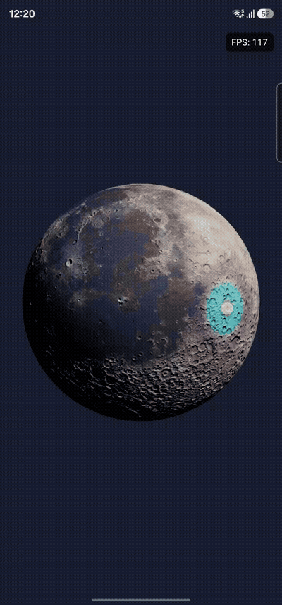

# 🌊 Reach Out and Touch Screen 

interactive Android 3D ripple playground

<table>
  <tr>
    <td valign="top" width="55%">
      <h2>About the project</h2>
      <p><strong>Reach Out and Touch Screen</strong> is an Android pet project focused on direct interaction with a real-time 3D scene rendered by <strong>Google Filament</strong>.</p>
      <p>The app presents a central PBR sphere that reacts to touch with animated shockwaves travelling across its surface. Several waves can remain active at once, overlap, reinforce one another, or partially cancel out through signed linear interference.</p>
      <p>This project brings together:</p>
      <ul>
        <li>modern Android development with <strong>Kotlin</strong> and <strong>Jetpack Compose</strong></li>
        <li>direct integration with the <strong>Google Filament Android API</strong></li>
        <li><strong>screen-to-world ray casting</strong> and sphere intersection</li>
        <li>GPU material parameters and analytical <strong>wave interference</strong></li>
        <li>explicit render-thread and GPU resource lifecycle management</li>
      </ul>
      <p>The project is intentionally compact: one clear interaction, developed through small and independently verifiable rendering milestones.</p>
      <h2>✨ Current functionality</h2>
      <ul>
        <li>Real-time Filament scene with a procedurally generated PBR sphere, camera, and directional light</li>
        <li>NASA-derived stylized lunar surface with restrained cool/warm color grading and normal-mapped terrain detail</li>
        <li>Touch coordinates converted into a world-space ray and a hit point on the sphere</li>
        <li>Up to 10 concurrent active ripple effects created by pointer-down events</li>
        <li>Bounded ripple storage with expiry, slot reuse, and deterministic oldest-first replacement</li>
        <li>The first pointer controls true 3D arcball rotation after hitting the Moon, handing off to bounded damped inertia on release or when the drag first leaves the projected trackball. Every successful pointer down can still create one ripple, and additional pointers do not affect rotation.</li>
        <li>Signed Ricker-wavelet profile with constructive and destructive linear interference</li>
        <li>Distinct crest and trough responses through color, roughness, and emissive material properties</li>
        <li>Compose FPS overlay for lightweight runtime diagnostics</li>
        <li>Unit-tested ray casting, intersection, mesh, ripple storage, and wave mathematics</li>
      </ul>
    </td>
    <td valign="top" width="45%">
      <h2>🎥 Demo</h2>
      <a>
        
      </a>      
    </td>
  </tr>
  <tr>
    <td valign="top" width="50%">
      <h2>🧱 Project structure</h2>
      <p>The project currently uses a deliberately small single-module structure:</p>
      <ul>
        <li><code>:app</code> - Compose UI, touch input, Filament integration, scene resources, ripple state, and deterministic math</li>
      </ul>
      <p>The main runtime pipeline is:</p>
      <p><code>Compose touch → surface coordinates → world-space ray → sphere hit → ripple state → Filament material</code></p>
      <p>Compose owns the screen, lifecycle observation, pointer input, and debug UI. Filament renders into the <code>Surface</code> supplied by <code>AndroidExternalSurface</code>.</p>
      <p>All Filament calls and resources are confined to a dedicated <code>HandlerThread</code>. The renderer explicitly owns the engine, scene, camera, geometry, material, swap chain, and frame scheduling.</p>
    </td>
    <td valign="top" width="50%">
      <h2>🛠 Tech stack</h2>
      <ul>
        <li><strong>Kotlin</strong></li>
        <li><strong>Jetpack Compose</strong></li>
        <li><strong>Material 3</strong></li>
        <li><strong>AndroidExternalSurface</strong></li>
        <li><strong>Google Filament 1.72.0</strong></li>
        <li><strong>Filament Material Language</strong> and <code>matc</code></li>
        <li><strong>Android Lifecycle</strong></li>
        <li><strong>HandlerThread</strong> and render-thread <strong>Choreographer</strong></li>
        <li><strong>JUnit4</strong></li>
        <li><strong>Gradle Kotlin DSL</strong></li>
      </ul>
    </td>
  </tr>
</table>

## 🚧 Project status

This project is **under active development**.

The current version already demonstrates the core interaction:

**touch the sphere → locate the 3D surface hit → create a travelling wave → combine overlapping ripple on the GPU**

The ripple effect currently changes material color, roughness, and emissive intensity. It does not yet modify vertex positions or surface normals, so the sphere's silhouette remains unchanged.

The lunar base-color and tangent-space normal textures are reproducibly derived from LROC imagery and LOLA elevation data in NASA's [CGI Moon Kit](https://svs.gsfc.nasa.gov/4720). The cool/warm color treatment is an artistic project grade, not a scientifically calibrated mineral map or a NASA visualization. LOLA height data contributes lighting detail through normal mapping only; it does not displace the sphere geometry. This static terrain detail is separate from any future ripple-driven vertex-displacement experiment.

Active ripples retain their logical age, position, and slot identity when an orientation change recreates the Activity. Filament and GPU resources are still recreated for each Activity instance.

## 📍 Roadmap / TODO

- [x] Build a stable Filament scene with explicit resource ownership and cleanup
- [x] Integrate Filament with Compose through `AndroidExternalSurface`
- [x] Convert screen touches into world-space rays and sphere intersections
- [x] Add one touch-driven ripple
- [x] Support up to 10 concurrent active ripple with bounded storage
- [x] Add a short demo GIF or video and complete portfolio polish
- [x] Add signed linear wave interference
- [x] Preserve active ripple across configuration changes
- [x] Add true simultaneous multitouch support
- [x] Add a NASA-derived stylized lunar base-color and normal-mapped surface
- [x] Add surface-anchored single-axis touch rotation with inertia
- [x] Prototype GPU vertex displacement and evaluate sphere mesh density
- [x] Trackball rotation
- [ ] Add a minimal interactive lighting experiment
- [ ] Run repeatable validation and performance checks on a physical Android device

## 🧠 Key engineering decisions

- **Direct Filament API** - no SceneView or third-party scene wrapper is used.
- **Compose and Filament have separate responsibilities** - Compose manages Android UI and input while Filament owns real-time 3D rendering.
- **One ripple per pointer down** - each new finger creates one ripple at its initial contact position; movement, release, and cancellation do not create more ripple.
- **Simultaneous multitouch and ripple lifetime are independent** - new fingers are accepted while others remain pressed, and up to 10 ripple can remain active after those fingers are released.
- **Fixed ripple capacity** - 10 preallocated slots keep runtime memory predictable and avoid per-frame collection churn.
- **Offline lunar asset pipeline** - checked-in runtime textures are generated from official NASA LRO maps; raw source TIFFs and image-processing dependencies are not shipped in the app.
- **Normal detail without displacement** - LOLA-derived tangent-space normals affect PBR lighting while the procedural sphere silhouette and ripple geometry remain unchanged.
- **Local-space interaction state** - touch rays are inverse-transformed for picking, while local ripple origins are transformed only for GPU upload, keeping existing ripple attached to the rotating sphere.
- **Analytical GPU effect** - ripple are evaluated from origin and start-time parameters instead of using a CPU simulation or simulation texture.
- **Signed accumulation first** - individual wave contributions are summed before bounded display mapping, allowing constructive and destructive interference.
- **Deterministic cleanup** - swap-chain lifetime follows the Android `Surface`, and renderer-owned resources are explicitly destroyed in dependency-safe order.

## 🧪 Verification

The deterministic parts of the implementation are covered by JVM unit tests, including:

- camera framing and screen-ray construction;
- ray/sphere intersection;
- procedural sphere mesh properties;
- ripple expiry, reuse, replacement, and capacity limits;
- signed wave behavior and interference;
- symmetric bounded display mapping.

The Kotlin wave model mirrors the material formula for deterministic testing. These tests do not execute the GPU shader, so visual quality and device performance still require manual verification.

Run the current automated checks with:

```bash
./gradlew :app:testDebugUnitTest
./gradlew :app:lintDebug
./gradlew :app:assembleDebug
```

## ▶️ How to run

### Requirements

- Android Studio compatible with the repository's Gradle wrapper
- Android SDK versions configured by the project
- An Android emulator or physical device with hardware-accelerated graphics

### Local setup

1. Clone the repository.
2. Open the project in Android Studio.
3. Let Gradle sync the project dependencies.
4. Select the `app` run configuration and an Android device.
5. Run the app and touch the visible sphere to create ripple.

No API keys or external services are required.

<p align="center"><em>Touch the surface and watch it respond.</em></p>
